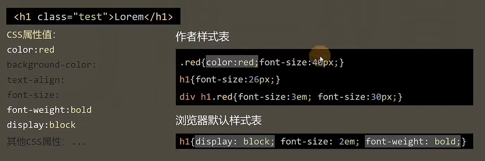
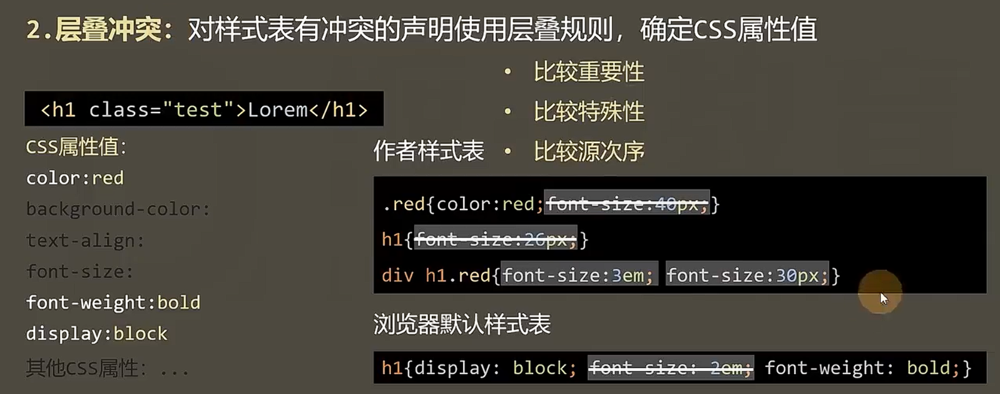
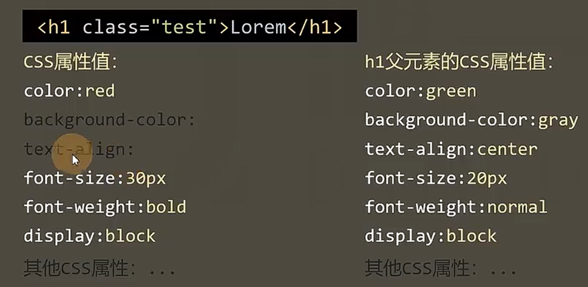

# 属性值的计算过程

渲染每个元素的前提条件：

- 该元素的所有 CSS 属性必须有值

一个元素从“所有属性没有值”到“所有属性都有值”的计算过程，叫做属性值的计算过程。

1. 确定声明值：参考样式表中没有冲突的声明，确定css属性值

2. 层叠冲突：对样式表有冲突的声明使用层叠规则，确定css属性值

3. 使用继承：对仍然没有值的属性，若可以继承，则继承父元素的值

4. 使用默认值：对仍然没有值的属性，使用默认值

## 两个特殊的 CSS 取值

- `inherit`：强制继承，将父元素的值取出应用到该元素
- `initial`：初始值，将该元素的属性取用初始值
